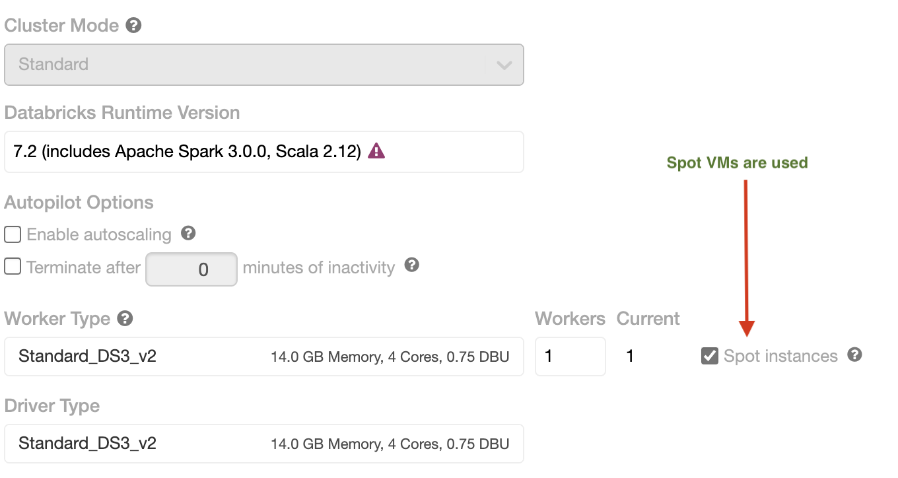
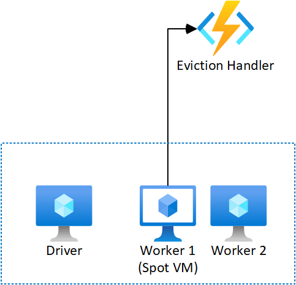
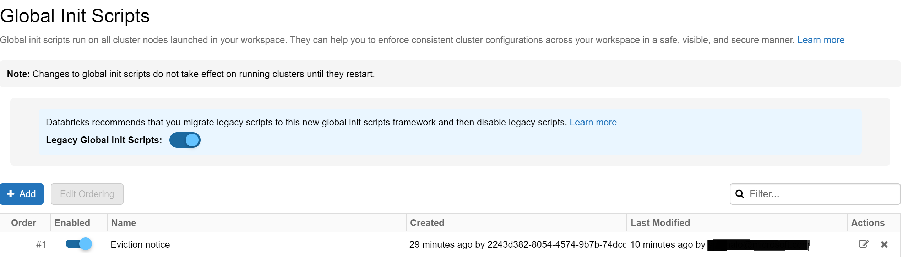

# Reduce Carbon Emissions with Spot VMs

Running applications on Spot VMs helps reduce carbon emissions by reducing energy consumption of an application and by reducing the need to purchase more datacenter hardware by increasing utilization of existing hardware. The latter significantly contributes to [Scope 3 carbon emissions](https://www.epa.gov/climateleadership/scope-3-inventory-guidance).

Currently very little documentation and guidance exists on how to run production-grade workloads on [Spot Virtual Machines](https://docs.microsoft.com/en-us/azure/virtual-machines/spot-vms) (Spot VMs). The project migrates an existing production workload to Spot VMs to learn about challenges and capture successful patterns in a migration playbook.

In a Hack for Good week relating to Sustainability, a team within Commercial Software Engineering (CSE) investigated strategies to work with and compensate an eviction of Spot VMs. We worked with a production-grade Spark workload of a previous engagement with Energinet (as part of the [Green Energy Hub](https://github.com/Energinet-DataHub/green-energy-hub)) as an example, leveraging the scenario and assets created in the engagement.

*Authors and project team in alphabetical order:*
*[Brandy Brown](https://github.com/brandynbrown), [Charles Zipp](https://github.com/charleszipp), [Christoph Schittko](https://github.com/xtophs), [Chuck Heinzelman](https://github.com/chuckheinzelman), [Neeraj Joshi](https://github.com/neejoshi), [Olha Konstantinova](https://github.com/OlhaKonstant), [Sherryl Manalo](https://github.com/hybridflux), [Sujit D'Mello](https://github.com/sujitdmello)*

## Detecting Evictions

The recommended approach for [detecting evictions](https://docs.microsoft.com/en-us/azure/virtual-machines/spot-vms#eviction-policy) is to use the [Scheduled Events API](https://docs.microsoft.com/en-us/azure/virtual-machines/linux/scheduled-events).

The scheduled events API imposes the following constraints

- The api must be polled. There is no push notification.
- The polling interval needs to be less than the minimum notice for the event (30 seconds for Spot VM eviction).
- **The API is only accessible from within the VM.**

> Given the eviction must be detected from within the VM that will be evicted, there is an extremely small window (smaller than 30 seconds) to react to the event.

### Simulation

Evictions can be simulated in cases where the VM is not part of a managed platform such as Azure Databricks or HDInsight. Eviction can be simulated for these VM's using the [Azure CLI](https://docs.microsoft.com/en-us/cli/azure/vm?view=azure-cli-latest#az_vm_simulate_eviction)

```shell
az vm simulate-eviction --resource-group MyResourceGroup --name MyVm
```

## Eviction Compensation

As noted above, the eviction can only be detected from within the VM that will be evicted. The time between detection and eviction could be under 30 seconds, depending on when it is detected. Compensation strategies will likely involve interactions with AzureRM to spin up new VMs, which could take minutes. This imposes another constraint:

- The compensation strategy will need to be able to run after the VM has been evicted (asynchronous execution).

### Solution Requirements

Given the concerns above, the solution NFRs can be summarized as:

- Schedule events API must be polled from each Spot VM at an interval smaller than or equals to 30 seconds
- The eviction compensation strategy must execute despite the VM having been evicted

### Compensation strategies

There are several possibilities to complensate an eviction. The choices could depend on

- the type of workload,
- the type of Azure Service used (managed service vs. unmanaged), or
- the SLAs required (length of run, near real-time reponse).

#### All on Spot

As an example, an organization could choose to deploy Spot VMs to process workloads which are not time-critical and which could be re-run in case the Spot instances get evicted while processing the workload. When an eviction gets detected, a call could be made to a custom service (i.e. Azure Functions) to compensate the eviction by

- restarting a deallocated VM,
- deploying other available Spot VM types,
- or deploying on-demand VMs to the cluster.

> Note: Information about the probability of a Spot VM type to be evicted in a region can be obtained from the Azure portal when creating a Spot VM. A specific VM type could be chosen by least probability of eviction in the region. Currently, this information cannot be obtained programmatically.

#### Mixed Spot and on-demand VMs

A deployment within a cluster could initially be a mixture of on-demand and Spot VMs, with on-demand VMs to pick up processing once Spot VMs get evicted. Once the eviction is detected, other Spot instances or on-demand VMs could be added to the cluster to distribute the load. This could apply to vanilla Spark workloads running in a VM scale set. A mixed deployment of Spot and on-demand VMs allows for the Spark workload to continue on on-demand instances while evicted Spot VMs are replaced and restarted.

Another example could be a temporary burst-out scenario, leveraging Spot VMs in addition to on-demand instances. Azure Kubernetes Services supports non-default node pools to run Spot VMs. Services could be deployed on the default, secondary Spot node pool, *or both*. In the time frame eviction occurs and the compensation strategy takes effect, the service still runs on the default on-demand pool and is available.

In the particular scenario we investigated below, the Azure Service running the workload is Databricks, which is a managed service with settings to control the behaviour of the cluster when deploying Spot VMs. The driver node, which controls job and task execution on worker nodes, is by default deployed on an on-demand VM and cannot be changed to run on Spot. When evicted, worker node Spot VMs can be replaced by on-demand VMs if a specific setting is used. Databricks manages the eviction with a specific compensation in this scenario.

## Workload Scenario

The Energinet data aggregation stream focuses on processing electricity metering data and making reports available to Grid operators, power stations and Retail energy providers.

Data is collected from IoT devices in Danish households and sent to IoT Hub to be processed further. The real-world scenario currently foresees 16 million time series values to be sent per hour, incoming from metering points every hour or 15 minutes. They plan to achieve higher resolutions up to 1 minute in the future (see [Green Energy Hub Time series](https://github.com/Energinet-DataHub/geh-timeseries)).

Another CSE team worked with Energinet until earlier in the year 2021 on this engagement and published generalized artifacts of the Spark workload processing the incoming data on [GitHub](https://github.com/katyamust/spark-in-production). In this generalized workload, a Databricks job fetches the time series data from Event Hub, and stores them in Delta Lake in parquet files to make it available for further processing and aggregation.  


As a side note, we deployed the infrastructure above with the Github workflow *infra-cd.yml*, leveraging Terraform resource creation on Azure. The workflow deploying the Spark streaming job on Databricks *streaming-cd.yml* creates a new cluster for the job with a specific Spark version, node type, and number of workers.

## Replacing Regular VMs with Spot VMs

Since Databricks supports leveraging Spot VMs for the Worker nodes, we were able to deploy the Databricks job by upgrading the Terraform provider to a version supporting the deployment of Spot VMs (`0.3.4`) and by adding `azure_attributes` to the deployment configuration of the new cluster. An example configuration for one node, specific spark version and VM node type could be:

```terraform
new_cluster {
    spark_version  = "7.2.x-scala2.12"
    node_type_id   = "Standard_DS3_v2"
    num_workers    = 1
  
    azure_attributes {
      availability       = "SPOT_WITH_FALLBACK_AZURE"
      first_on_demand    = 1
      spot_bid_max_price = -1
    }
  }
```
The deployment was successful as could be seen in the job cluster configuration:



### Findings on configuration settings used to control Spot VMs changing to regular VMs

**`first_on_demand`**
&nbsp;  
The [docs](https://docs.microsoft.com/en-us/azure/databricks/dev-tools/api/latest/clusters#--azureattributes) say that setting a value **greater than 0** will result in the first few nodes with *on-demand* pricing, which is consistent with our test results. However, setting this value to **0** does not fail the cluster creation as the docs say. After trial-and-error, we discovered that the **driver** node (first node) is always placed on *on-demand* instances. So in effect, a setting of `first_on_demand=1` is used even if you set the value to 0 or do not specify the value at all. This is not a problem for our design as we wanted the driver node to be on-demand to ensure a stable cluster.

**`availability`**
&nbsp;  
In order to confirm wheter the system resorts to on-demand instances in case the Spot instances are not available, the `spot_max_bid_price` can be set to a value just below the current Spot asking price.

Our expectation was, that the cluster Worker node would be created on on-demand instances. However, the cluster creation fails consistently. The possible explanation is that the setting `availability=SPOT_WITH_FALLBACK_AZURE` only goes into effect once a cluster is up and running and that it initially tries to use Spot VMs for the Worker nodes. This will fail since the Spot price is too low.

Changing the `spot_max_bid_price` to a value just above the current Spot asking price results in the cluster successfully being created.

## Solutioning: Our Approach



### Detection

To detect evictions, [a detect eviction cron job](./detecteviction/README.md) was created that polls the scheduled events API at a regular interval. This script should be bootstrapped to the VM upon its creation. This satisfies the first requirement by executing from within the VM itself.

Once the job detects eviction, it makes a request to the API responsible for handling the eviction notice asynchronously. This adheres to the second requirement by invoking a _fire-and-forget_ operation that should take milliseconds to complete, which is well within the window of the VM actually being shutdown.

In our scenario with Databricks, the eviction detection script was added to the Terraform configuration for the streaming job creation as a resource `databricks_global_init_script`:

```terraform
resource "databricks_global_init_script" "evictionnotice" {
  source = "${path.module}/scripts/detecteviction.sh"
  name = "Eviction notice"
}
```



### Notice Handling (Eviction Compensation)

To handle the eviction notice, we created an [Eviction Handler Azure Function](./src/node/eviction/README.md). This function exposes a single endpoint that accepts information about the VM being evicted. The API responds with `202 Accepted`, which acknowledges receipt of the eviction and indicates it will be handled asynchronously.

```typescript
const httpTrigger: AzureFunction = async function (context: Context, req: HttpRequest): Promise<void> {
    context.log.info('eviction notice received from ' + JSON.stringify( req.body ) );

    // call Action upon eviction notice
    try {
        Action( context.req.body.name, context.req.body.rgname );
    
        context.res = {
            status: 202,
            body: context.req.body
        };
    }
    catch( err ) {    
    // code to catch
        };
    }
```

The API is expected to execute a compensation strategy in `Action` which may include [restarting the VM](./src/node/eviction/EvictionHandler/index.ts) or provisioning an additional VM to replace the one being evicted.

```typescript
    function Action( vmName:string, rgName: string ) {

        // code relating to action

        return;
    };
```

Since Databricks has its in-built compensation mechanism to prevent the disruption of the service with `spot_bid_max_price=-1`, or the setting to fall back to standard instances with `availability=SPOT_WITH_FALLBACK_AZURE`, it is not necessary to restart or provision VM instances. The Action set here could be a notification to service administrators or a modification of the cluster configuration with another available Spot VM type and restarting the job.

### Standalone Spark Environment (Eviction Simulation)

Due to access restrictions to the instances on Databricks, we were not able to simulate an actual eviction. To simulate the eviction, we manually created a cluster and installed the necessary Spark binaries to run the workload from the scenario running on Databricks and submitted it as a Spark job to run on the cluster. The [workload code](./src/python/workload.py) was only modified to run on the standalone Spark environment without changing its functionality. The setup contains:

- a Spark Driver VM (Non-Spot),
- a Spark Worker VM (Non-Spot),
- and an additional Spark Worker VM (Spot).

We simulated various evictions:

- Spark process on Worker node fails: The remaining node picked up the work as expected.
- Restart Spark process on Worker node: The node rejoins the cluster and starts getting work (as expected).
- Evict Spot VM: When the VM gets deallocated, the remaining Non-Spot node picked up the work as expected.
- Restart Spot VM: When the Spot VM came back up, it joined the cluster and started getting work (as expected).

The Driver node keeps track of the job and task completion of the workload on the Worker nodes and intructs either the remaining Non-Spot node or a restarted node to continue processing the job/tasks.

## Financial Impacts + Considerations

### Spot VM Price Checks

Pricing for Azure Spot Virtual Machines is based on a region and SKU. Pricing information can be queried using the [Azure Retail Prices API](https://docs.microsoft.com/en-us/rest/api/cost-management/retail-prices/azure-retail-prices).

#### Azure Retail Prices API

To query a Spot VM price the meterName and skuName parameters should both contain `Spot`. Here is an example what the output looks like:

```JSON
    {
        "currencyCode": "USD",
        "tierMinimumUnits": 0.0,
        "retailPrice": 0.176346,
        "unitPrice": 0.176346,
        "armRegionName": "westeurope",
        "location": "EU West",
        "effectiveStartDate": "2020-08-01T00:00:00Z",
        "meterId": "000a794b-bdb0-58be-a0cd-0c3a0f222923",
        "meterName": "F16s Spot",
        "productId": "DZH318Z0BQPS",
        "skuId": "DZH318Z0BQPS/00TG",
        "productName": "Virtual Machines FS Series Windows",
        "skuName": "F16s Spot",
        "serviceName": "Virtual Machines",
        "serviceId": "DZH313Z7MMC8",
        "serviceFamily": "Compute",
        "unitOfMeasure": "1 Hour",
        "type": "DevTestConsumption",
        "isPrimaryMeterRegion": true,
        "armSkuName": "Standard_F16s"
    } 
```

#### Price Checking Script

This [script](./scripts/pricing_check.sh) checks Azure Spot prices in different regions:

| Parameter | Name                         | Required? | Default Value                | Data Type |
| --------- | ---------------------------- | --------- | ---------------------------- | --------- |
| -s        | sku name                     | No        | DS3 v2                       | string    |
| -p        | product name of the offering | No        | Virtual Machines DSv2 Series | string    |
| -l        | location                     | No        | US East                      | string    |
| -r        | repeat price checking        | No        | false                        | bool      |

If the parameter -r is set to `true`, the script will check a price every 60 seconds and ask the user to confirm this with inputting (y) for yes or (n) for no.

Query contains next filters:

- skuName
- location
- serviceName
- reservationTerm
  - Applicable to regular VMs so pay as you go pricing is being checked, and not price for Reserved Virtual Machine Instances
- productName
  - to separate Linux from Windows machines

### Analysis - How to change Spot VM prices on a running cluster

The Databricks Cluster [CLI](https://docs.microsoft.com/en-us/azure/databricks/dev-tools/cli/clusters-cli) allows editing of various parameters of the cluster. One of them is the `spot_bid_max_price` of the Worker nodes used in the cluster. The JSON file used to configure the cluster via the API looks like this:

```json
{
    "cluster_id" : "0520-195721-vivas527", 
    "spark_version" : "7.2.x-scala2.12",
    "node_type_id" : "Standard_DS3_v2",
    "num_workers" : "2",

    "azure_attributes" : {
      "availability" : "SPOT_WITH_FALLBACK_AZURE",
      "spot_bid_max_price" : "0.144",
      "first_on_demand" : "1"
    }
  }
```

Where `cluster_id` is the existing cluster ID.

> Note that it is **not** possible to change the `spot_bid_max_price` of a running cluster.

Once you issue the **databricks clusters edit --json-file <config.json>** command, the cluster is stopped and resources deallocated, and a new cluster with the configuration settings is created. Jobs can then be re-run on the new cluster. The `cluster_id` remains the same after the update.

> If the `spot_bid_max_price` specified is below the current asking price for Spot VMs of the specified `node_type_id`, then the cluster creation will fail.
